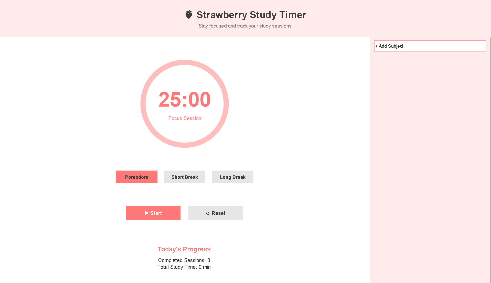

# 🍓 Strawberry Pomodoro – Java Study Timer

Strawberry Pomodoro is an aesthetic and functional **Pomodoro study timer** built with **Java Swing**.  
It helps students stay focused, track daily study progress, and manage subjects in a clean, strawberry-themed interface.

This project was created as a **Java GUI learning project** and is suitable for school assessments, personal productivity, and portfolios.

---

## ✨ Features

### ⏱️ Pomodoro Timer

- 25-minute focus sessions
- 5-minute short breaks
- 15-minute long breaks (every 4 Pomodoros)
- Automatic mode switching
- Start, pause, resume, and reset controls

### 📊 Daily Progress Tracking

- Completed Pomodoro sessions
- Total study time per day
- Automatic daily reset at midnight

### 📚 Subject Management

- Add, select, and remove subjects
- Track sessions and minutes per subject
- Highlight the currently active subject

### 🎵 Break Music & Alarm

- Random lofi / background music during breaks
- Alarm sound when a session ends
- Music automatically stops during focus sessions

### 💾 Data Persistence

- Saves daily progress to a local file
- Reloads study data on app restart

### 🎨 Aesthetic UI

- Strawberry-inspired color palette
- Large circular timer display
- Minimal, distraction-free layout

---

## 🛠️ Built With

- **Java**
- **Java Swing (GUI)**
- **Java Sound API**
- **JOptionPane**
- File handling (`.txt` persistence)

---

## 📂 Project Structure

StrawberryPomodoro/
│
├── StrawberryPomodoro.java
├── strawberry_progress.txt
└── README.md

---

## ▶️ How to Run

1. Make sure you have **Java JDK 8 or higher** installed
2. Clone or download this repository
3. Open the project in **Eclipse** or any Java IDE
4. Run the `StrawberryPomodoro` class

⚠️ **Note:**  
Update the music file paths in the code to match your local machine.

---

## 🎯 Who This Is For

- High school & university students
- Exam preparation & daily study routines
- Java Swing practice
- School practical assessments
- Beginner-to-intermediate Java portfolios

---

## 🚀 Planned Improvements

- 📅 Calendar view
- 📈 Weekly study graphs
- 🌙 Dark mode
- 🗃️ Database support
- 📤 Export study statistics

---

## 📸 Screenshots

---

## 📄 License

This project is intended for **educational and personal use**.

---

## 💖 Credits

Designed & developed by **Semira**  
Inspired by the Pomodoro productivity technique 🍅
